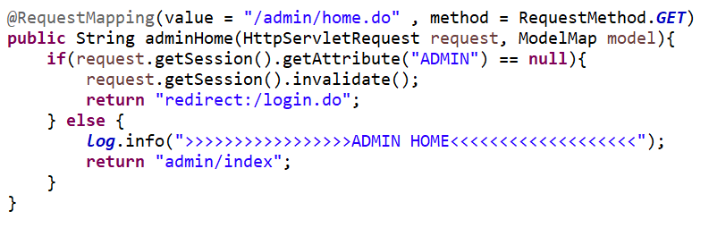
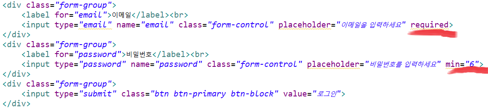
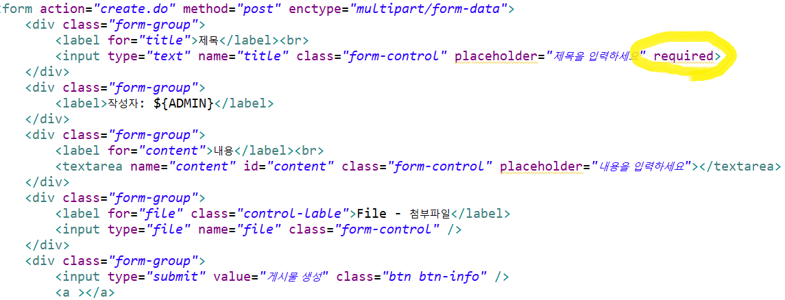
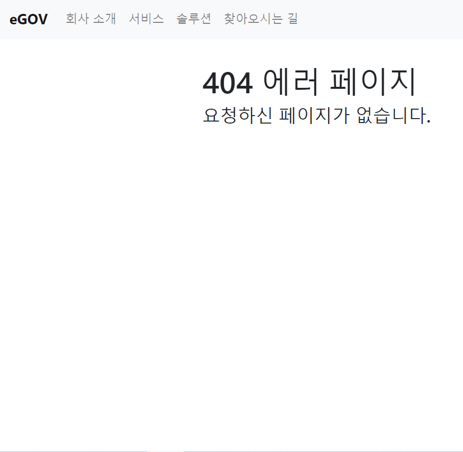
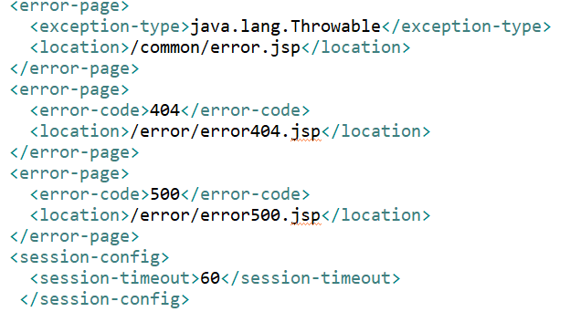

# eGOV_BBS

## 개요
스프링의 기반을 둔 전자정부프레임워크 사용하여 게시판과 로그인 기능을 구현해보았습니다. 

## 기술
* 전자정부프레임워크 3.7.0
* Spring Framework 4.2.4
* Oracle XE 18c
* MyBatis 3.3.0
* Bootstrap 4.4.1
* CK Editor 4.14.0

## 기능
* 게시판
    * Input 값 유효성 체크[Back-End, Front-End(HTML5 Attribute)]
    * 전자정부프레임워크 Pagination[Text, Image]
    * 작성(Create)
        * 첨부파일 저장
        * 위지위그(CK Editor)
    * 조회(Read)
        * Oracle Procedure 사용[Select]
        * 첨부파일 다운로드
        * 조회수 + 1 Update
    * 수정(Update)
        * 첨부파일 수정 및 저장
        * 위지위그(CK Editor)
    * 삭제(Delete)
        * 일괄삭제[Batch Delete]
* 로그인
    * 모든 페이지 별 세션 체크 및 이용자 ROLE 체크
    * 세션 타이머 값 지정
    * Input 값 유효성 체크[Back-End, Front-End(HTML5 Attribute)]
    * 로그아웃 [세션 파괴]
* 에러 페이지
    * 커스텀 404,500 및 자바 예외처리 에러 페이지
    
## 데모
링크 -> https://www.youtube.com/watch?v=_fpnwSetD7s&t=5s
    
## 코드
* **서버에서 유효성 검사[세션 체크]**

* **Front-End에서 유효성 검사 [간단히 HTML5 Attribute 사용]**
    * 로그인 페이지

    * 게시판 작성 페이지

* **Error 페이지[404, 500, 예외처리]**
    * 커스텀 페이지 모습

    * web.xml 설정[로그인 세션 값도 설정]

